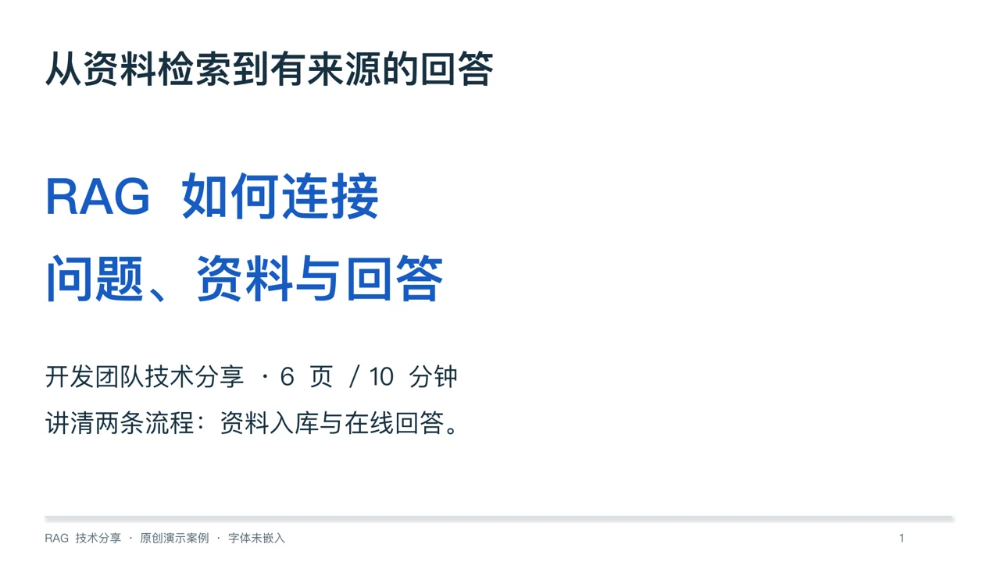

# 技术分享：RAG 与有来源的回答

[返回案例目录](../README.md)

## 输入与交付

- [输入资料与逐页内容](source.json)
- [调用提示](prompt.md)
- [6 页原生可编辑 PPTX](deck.pptx)
- [六页总览](gallery.webp)
- [验证记录](receipt.json)

原创教学材料；没有运行 RAG 服务、性能基准或真实报销流程。

本次 Codex 会话直接读取本地 subaru-slides 指引，再用 python-pptx 构建原生对象。输入文件同时包含人工编写的逐页内容；重建脚本是确定性排版，不是模型端到端自动生成。备注说明来源与假设，没有第三方截图、图片或字体入包。

## 检查与边界

最终 PPTX 经过复读、结构校验与 LibreOffice 六页逐页渲染目检。文字、表格、图表（如有）和流程图为原生对象。字体为 PingFang SC，未嵌入；PowerPoint、Keynote、Google Slides 实机和收件人字体未验证。结构校验不证明目标应用中所有编辑操作或内容效果。

## 重建

在仓库根目录执行：

~~~bash
uv run examples/build_decks.py --case rag-sharing
~~~

仅需脚本声明的 python-pptx，不需要生图、网络资料或外部 skill。首次 uv 解析依赖可能需要联网。生成器重建 PPTX 与结构 receipt；重新生成后，应重新渲染、检查并更新预览与验证记录。当地字体可用性需要另行确认。

本案例内容、构建代码与预览为原创，适用根 MIT LICENSE；不改变 subaru-slides 第三方内容的许可边界。英文摘要与下载入口随文档站提供。
